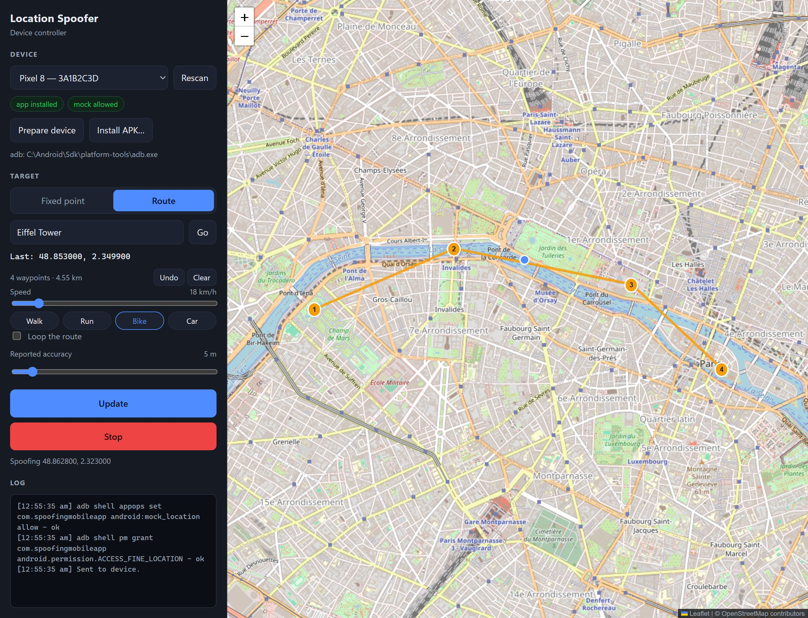

<div align="center">

# Location Spoofer

**Put your Android phone anywhere on the map — from the phone itself, or from your Windows PC.**

[](https://github.com/teykaijun/SpoofingApp/releases/latest)
[](https://github.com/teykaijun/SpoofingApp/releases)
[](LICENSE)


[](https://buymeacoffee.com/casunoxd)

**[Download for Android](https://github.com/teykaijun/SpoofingApp/releases/download/v1.2.0/LocationSpoofer-v1.2.0-debug.apk)** ·
**[Download for Windows](https://github.com/teykaijun/SpoofingApp/releases/download/v1.2.0/LocationSpoofer-windows-v1.2.0.zip)** ·
[All releases](https://github.com/teykaijun/SpoofingApp/releases)



</div>

## Why this exists

Anything that depends on where a phone is — delivery and ride-hailing flows, geofenced
reminders, store finders, fitness trackers, travel apps — is slow and awkward to test by
physically walking around. Location Spoofer sets your phone's GPS position to any point on
Earth, or moves it along a route at a realistic speed, using the mock location API that Android
provides for exactly this job. No root, no hacks.

It comes in two parts that work alone or together:

- **Android app:** pick a point or draw a route on the phone, and it feeds that position to the
  apps on the device.
- **Windows controller:** do the same from a big screen. Plan routes with a mouse, set up a
  phone in one click, and drive Android emulators directly.

It's handy for:

- testing location-based features and geofences without leaving your desk
- reproducing "works in Singapore, broken in Berlin" bugs
- demoing a location-aware app as if you were somewhere else
- previewing how your own app looks and behaves in other cities

## Download

| Platform | Download | Requirements |
| --- | --- | --- |
| Android | [LocationSpoofer-v1.2.0-debug.apk](https://github.com/teykaijun/SpoofingApp/releases/download/v1.2.0/LocationSpoofer-v1.2.0-debug.apk) (19 MB) | Android 8.0 or newer |
| Windows | [LocationSpoofer-windows-v1.2.0.zip](https://github.com/teykaijun/SpoofingApp/releases/download/v1.2.0/LocationSpoofer-windows-v1.2.0.zip) (63 MB) | Windows 10/11 x64, [adb](https://developer.android.com/tools/releases/platform-tools), WebView2 Runtime (built into Windows 11) |

Both are free and open source. Release notes and older versions are on the
[releases page](https://github.com/teykaijun/SpoofingApp/releases).

## Quick start

### On the phone

1. Install the APK. Android will ask you to allow installs from unknown sources.
2. Turn on Developer options: Settings › About phone › tap **Build number** 7 times.
3. In Developer options, set **Select mock location app** to **Location Spoofer**.
4. Open the app and allow location access. Tap the map, then tap **Start spoofing**.

### With the Windows controller

1. Turn on **USB debugging** in the phone's Developer options, plug it in, and accept the prompt.
2. Unzip the Windows download and run `SpoofingApp.exe`. If Windows refuses to start it,
   right-click the zip › Properties › tick **Unblock**, then extract it again.
3. Pick your phone, click **Install APK…** the first time, then **Prepare device**. That does the
   Developer-options setup for you.
4. Click the map or draw a route, then click **Start spoofing**.

To get your real location back, tap **Stop** in either app or in the phone's notification.

## Features

### Android app

- **Fixed point:** tap the map, search for a place, paste coordinates, or pick a favorite.
- **Route simulation:** tap waypoints and move along them at walking, running, cycling, driving
  or custom speed (1–150 km/h), with optional looping. Speed and bearing are reported too.
- **Covers the whole location stack:** the platform GPS and network providers (plus the
  platform fused provider on Android 12+) and Google Play services' fused location provider,
  which most apps, including Google Maps, read from.
- **Keeps running in the background** as a foreground service, with a Stop button in the
  notification.
- **Live changes:** apply a new point, speed or accuracy while spoofing. Changing only speed,
  loop or accuracy keeps your position on the route.
- **OpenStreetMap** map with no API key, favorites, and adjustable accuracy and update interval.
- **Updates itself:** More options › **Check for updates** fetches the newest release from
  GitHub and hands it to Android's installer, so you never have to re-download the APK by hand.

### Windows controller

- Lists every device and emulator adb can see.
- **Prepare device** grants everything over adb: it makes the app the selected mock location app
  and grants the location and notification permissions, so Developer options never has to be
  opened.
- **Install APK…** sideloads the app onto the selected device.
- Fixed point or multi-waypoint route with speed and looping, handed to the phone app, which
  runs the simulation itself.
- **Emulators** need no app at all: the PC steps them along the route once per second with
  `adb emu geo fix`.
- Place search (OpenStreetMap Nominatim), coordinate paste, and a log of every adb command.

## Support the project

Location Spoofer is free and built in my spare time. If it saved you a walk around the block,
you can buy me a coffee — it genuinely helps keep the project going.

<a href="https://buymeacoffee.com/casunoxd"></a>

Bug reports, ideas and pull requests are welcome too — open an
[issue](https://github.com/teykaijun/SpoofingApp/issues).

## Use it responsibly

Location Spoofer is a testing tool. Faking your location to deceive other people or services,
such as games, dating apps, or attendance and delivery systems, usually breaks their terms and
can get your accounts banned. Apps can also detect mocked locations (`Location.isMock()`), and
many do.

---

## For developers

### Build the Android app

```bash
gradlew.bat assembleDebug
```

```bash
adb install -r app/build/outputs/apk/debug/app-debug.apk
```

Or open the folder in Android Studio and press **Run**. Building needs JDK 17+ and the Android
SDK, both of which Android Studio bundles.

### Build the Windows controller

```bash
dotnet run --project windows/SpoofingApp.Desktop
```

```bash
dotnet publish windows/SpoofingApp.Desktop -c Release -r win-x64 --self-contained true -o out
```

Building needs the .NET 10 SDK. adb is found automatically via `ANDROID_HOME`,
`ANDROID_SDK_ROOT`, `%LOCALAPPDATA%\Android\Sdk`, or `PATH`.

### Remote control over adb

The phone app accepts commands directly, which is how the Windows controller drives it. Start a
route:

```bash
adb shell am start -n com.spoofingmobileapp/.MainActivity -a com.spoofingmobileapp.action.REMOTE --es command start --es points '48.8584,2.2945;48.8606,2.3376' --es speed 18 --es loop true
```

Stop:

```bash
adb shell am start -n com.spoofingmobileapp/.MainActivity -a com.spoofingmobileapp.action.REMOTE --es command stop
```

Extras are all strings, because that is what `adb shell am` passes reliably: `points` is
`lat,lng` pairs separated by `;`, `speed` is km/h, `loop` is `true`/`false`, and `accuracy` is
metres. A command is applied once the activity resumes, since Android only lets a location
foreground service start while the app is actually in the foreground.

Becoming the mock location app without touching Developer options:

```bash
adb shell appops set com.spoofingmobileapp android:mock_location allow
```

### How it works

`MockLocationService` is a foreground service. It registers test providers through
`LocationManager.addTestProvider`, switches Play services into mock mode with
`FusedLocationProviderClient.setMockMode`, and pushes a fresh `Location` every update interval,
because Android discards mock fixes that stop updating. `RouteSimulator` interpolates positions
along great-circle segments; the Windows app carries a C# port of the same maths for emulators.

```
app/src/main/java/com/spoofingmobileapp/
├── spoof/   MockLocationService, MockLocationPusher, MockLocationSetup, SpoofConfig, RemoteCommand
├── geo/     LatLng, GeoMath, RouteSimulator, CoordinateParser, PlaceSearch, Units
├── data/    FavoritesRepository, SettingsRepository
└── ui/      MainScreen, SpoofMap (osmdroid), ControlPanel, SearchBox, SetupCard, dialogs

windows/SpoofingApp.Desktop/
├── Adb/       AdbClient, AdbDevice parsing
├── Spoofing/  SpoofCommands, GeoMath, RouteSimulator, EmulatorRoutePlayer
├── Web/       the UI (Leaflet map) hosted in WebView2
└── MainWindow.xaml.cs   bridge between the page and adb
```

### Tests

```bash
gradlew.bat testDebugUnitTest
```

```bash
dotnet test windows/SpoofingApp.slnx
```

## Limitations

- Some apps, such as banking, anti-cheat or attendance apps, deliberately reject mocked
  locations.
- **Windows itself cannot be spoofed.** Windows has no mock location API, so the desktop app
  controls Android devices rather than faking the PC's own position; doing that would need a
  virtual GPS driver.
- **iPhone isn't supported.** iOS doesn't let apps change the location other apps see.
- Place search on the phone uses the device's built-in geocoder, which needs Google Play
  services and a network connection. Typing coordinates always works.
- The APK is debug-signed for sideloading. From 30 September 2026, phones in Brazil, Indonesia,
  Singapore and Thailand only install apps from unregistered developers through Android's
  advanced install flow or `adb install`.
- Map data and tiles come from OpenStreetMap. Please respect its
  [tile usage policy](https://operations.osmfoundation.org/policies/tiles/) and
  [Nominatim usage policy](https://operations.osmfoundation.org/policies/nominatim/).

## License

[MIT](LICENSE) © kjkaijun

Map data and tiles © OpenStreetMap contributors. This project also depends on osmdroid
(Apache-2.0), Google Play services Location and Microsoft WebView2, which carry their own terms.
